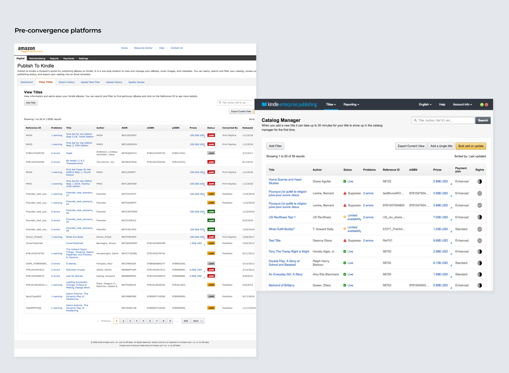
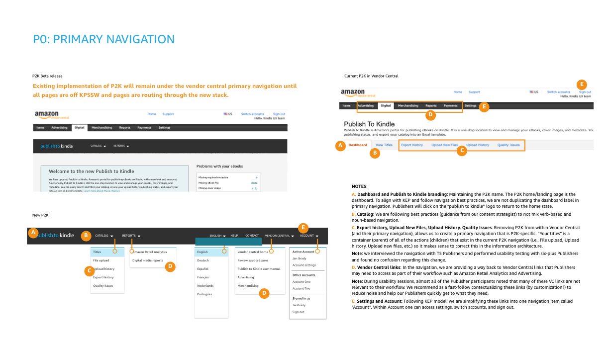
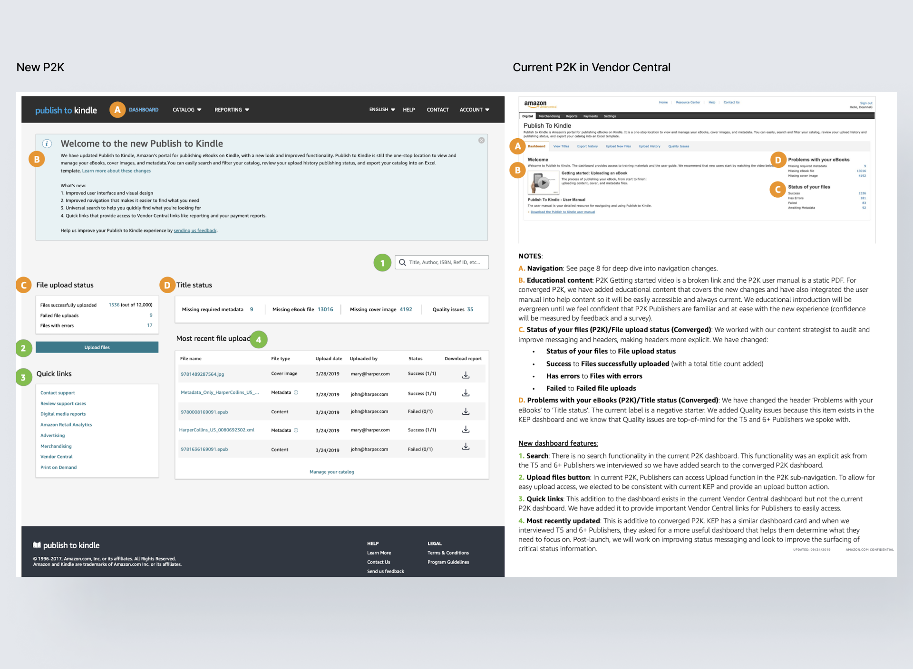
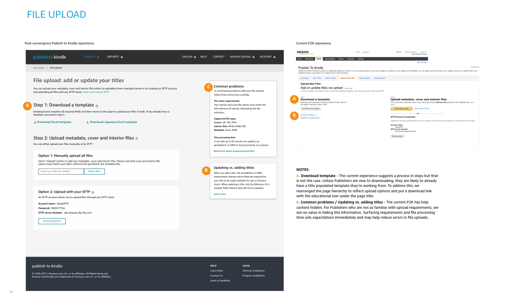
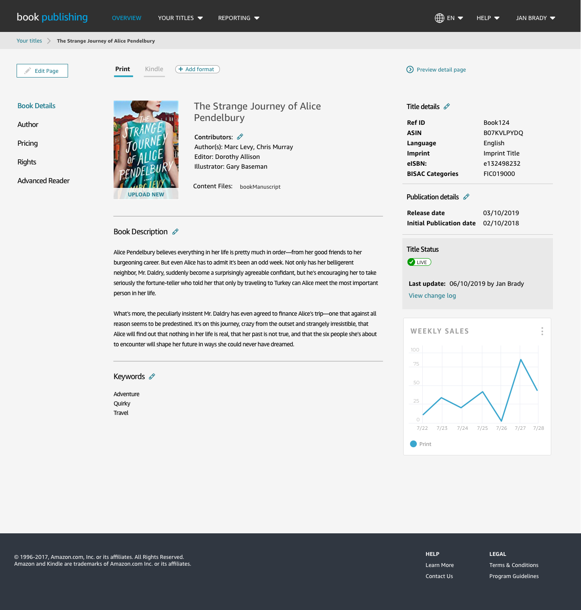

## The challenge

### Consolidating without shipping the old friction

Publishers jumped between platforms to do one job. Tasks were duplicated, errors were common, and training and support costs were high.

The business mandate was 100% feature parity. But Vendor Central was never built for publishers managing thousands of titles — parity meant porting known usability issues into the new platform. Leadership was focused on parity and wary of anything beyond it, including fixes to problems everyone agreed existed.

> The real problem was not consolidation. It was how to consolidate without intentionally shipping the old friction.

## The audit

### Making the cost of parity visible

I built a comprehensive audit comparing all three platforms feature by feature. It documented every inconsistency in navigation, labeling, and actions, and it named the pain points in bulk workflows, metadata entry, and content validation. Each issue came with a recommendation.

I took it to engineering before presenting to leadership. Once engineers could see the actual scope of what parity would cost, we collectively prioritized the fixes. That alignment is what convinced leadership to trust our judgment on what to fix and what to carry forward.

## Approach

### Structured around how publishers think

**Research** — Interviews with Tier 5 and 5+ publishers, our most advanced users with the most complex workflows. Their language shaped the IA, the terminology, and the interaction patterns.

**Information architecture** — Grouped tasks by user goal rather than by legacy platform origin, so the structure reflected how publishers think about their catalog instead of how Amazon's tools happen to be built.

**Reduce load, preserve familiarity** — New patterns mirrored flows publishers already knew but fixed the hierarchy: batch editing, simpler metadata input, clear status visibility.

**Co-design and testing** — Walked flows live with publishers, refined against their edge cases, then ran structured usability testing across occasional users and power users.

## From friction to flow

In the legacy system, publishers navigated multiple tabs just to upload a cover and its content files. I consolidated the related actions into a single view, which matched how publishers actually think about a title.

## Impact

### From strict parity to funded fixes

**Changed what got funded** — The audit moved leadership off strict parity. Usability fixes they had deferred indefinitely were scoped, prioritized, and built.

**Foundation for the unified backend** — Validated IA, scalable patterns, and specs written against engineering requirements. Development of the consolidated system was built on this work.

**Reduced ambiguity for engineering** — Aligning design with the unified backend and documenting it thoroughly let the team move faster with fewer open questions.

## Future vision

Alongside convergence, I developed a concept for one workflow across every book format. Publishers had long been frustrated that digital lived in KEP, print lived in Vendor Central, and audio lived in Audible.

I designed a unified dashboard, catalog manager, and title detail view, and shared them with publishers, who responded strongly to seeing their feedback taken seriously. The work required cross-organizational collaboration and is still ongoing inside the Books organization.

