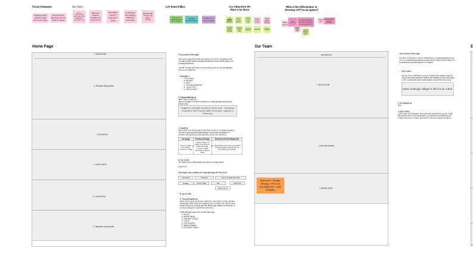
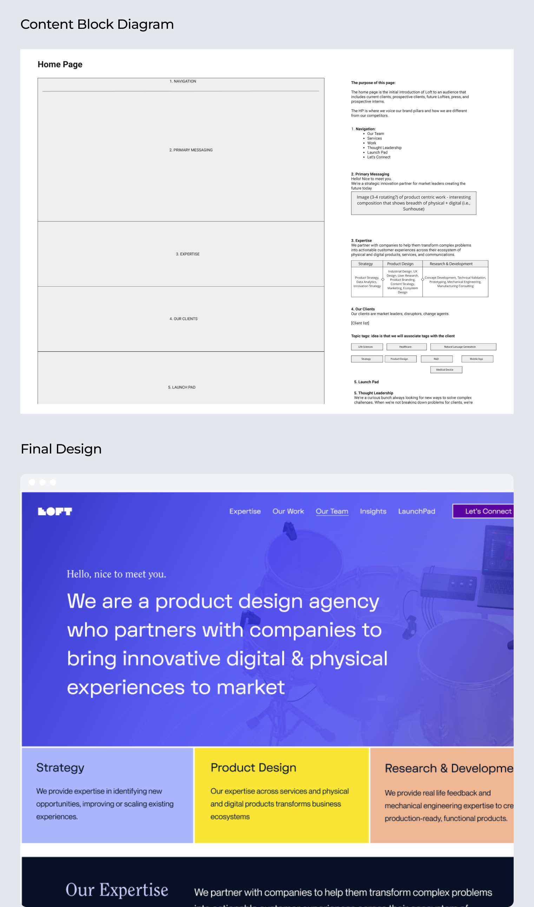
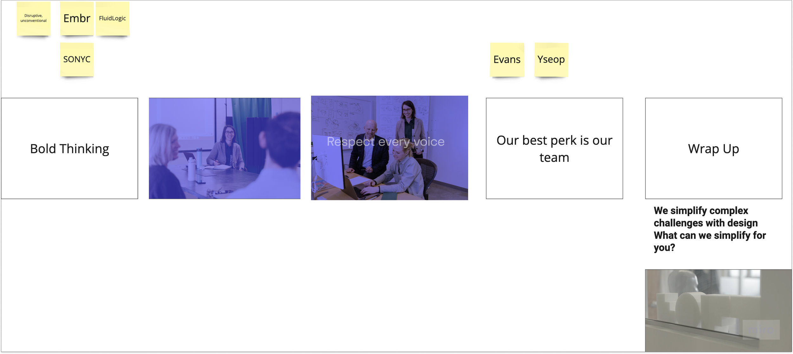
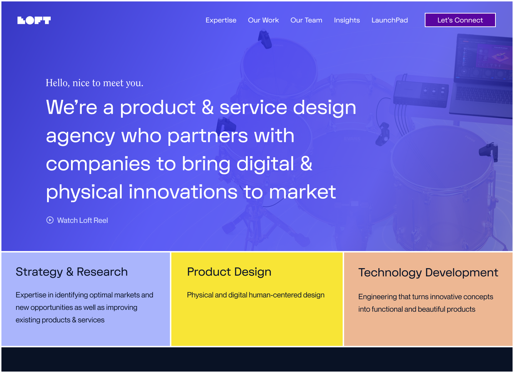

## The challenge

### One story, two tracks

A design agency's own brand is the hardest client. Loft's rebrand ran on two parallel tracks — a new marketing website and an agency reel — and both had to tell the same story about who Loft was and what it delivered.

That meant getting the message right before getting the visuals right: a cohesive strategy that balanced brand storytelling with usability, and a structure that could scale to support future growth.

## Approach

### Message first, medium second

**Strategic facilitation** — I led messaging workshops with stakeholders to clarify brand positioning and align the team around a cohesive vision for the rebrand, defining a shared understanding of the company's value proposition and making sure it showed up at every touchpoint.

**Marketing website redesign** — I developed the messaging strategy and content block diagrams that structured the site's content, giving the visual design direction a foundation to build on. I collaborated with another designer on themed conceptual design versions, keeping each aligned with the overall brand strategy.

**Creative direction for the agency reel** — I conceptualized and storyboarded the reel, providing creative direction to align the final product with Loft's brand identity. Partnering with two other designers, we crafted a narrative showcasing Loft's values and client success stories.

## From content blocks to final design

The content block diagrams did the heavy lifting: each page was structured around its message — what it needed to say and in what order — before any visual design began. The final designs filled those frames, so the brand voice survived the trip from workshop wall to shipped site.

## The agency reel

The reel had to compress Loft's breadth — strategy, product design, engineering — into a story a prospective client would actually watch. I storyboarded it around Loft's brand pillars, moving from bold thinking through team culture to a closing invitation: what can we simplify for you?

  <iframe style="width: 100%; height: 100%;" src="https://www.youtube-nocookie.com/embed/ZC3xi0QemPo" title="Loft.Design agency reel" frameborder="0" loading="lazy" allow="accelerometer; autoplay; clipboard-write; encrypted-media; gyroscope; picture-in-picture; web-share" referrerpolicy="strict-origin-when-cross-origin" allowfullscreen></iframe>

## Outcomes

### A brand that sells the work

**A rebranded marketing website** — Elevated Loft's market presence, clarified its value proposition, and improved user engagement.

**An agency reel with a job** — The visually rich reel became instrumental in Loft's business development strategy, showcasing the company's breadth of experience and creative capabilities.

**A reusable blueprint** — The content strategy workshops and discovery efforts didn't just bring cohesion to the Loft brand; they became a blueprint for client-facing work, demonstrating the value of strategic facilitation in aligning teams and outputs.

