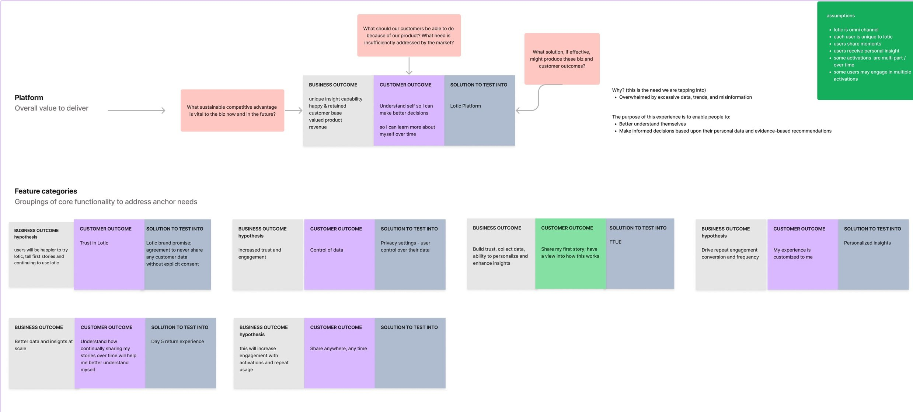
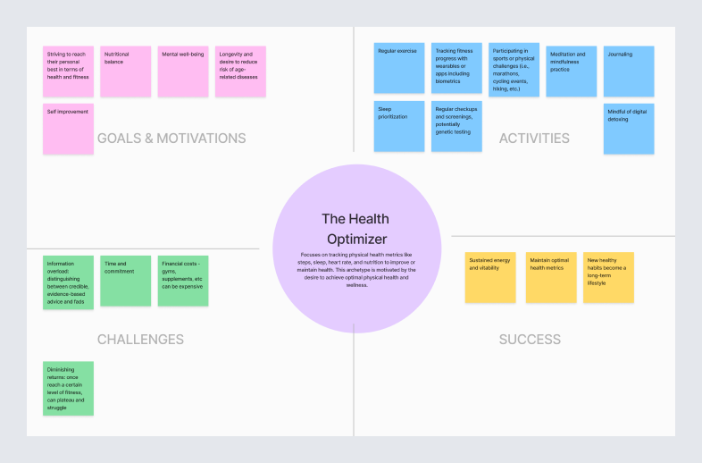
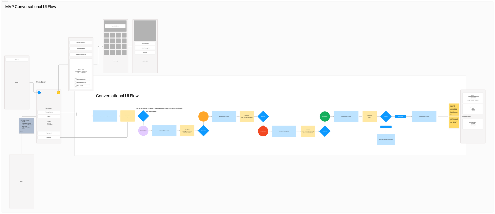
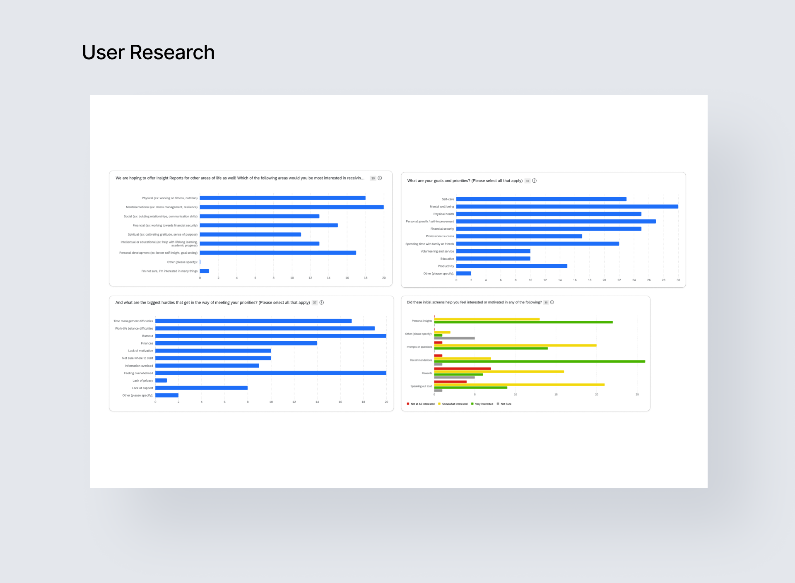
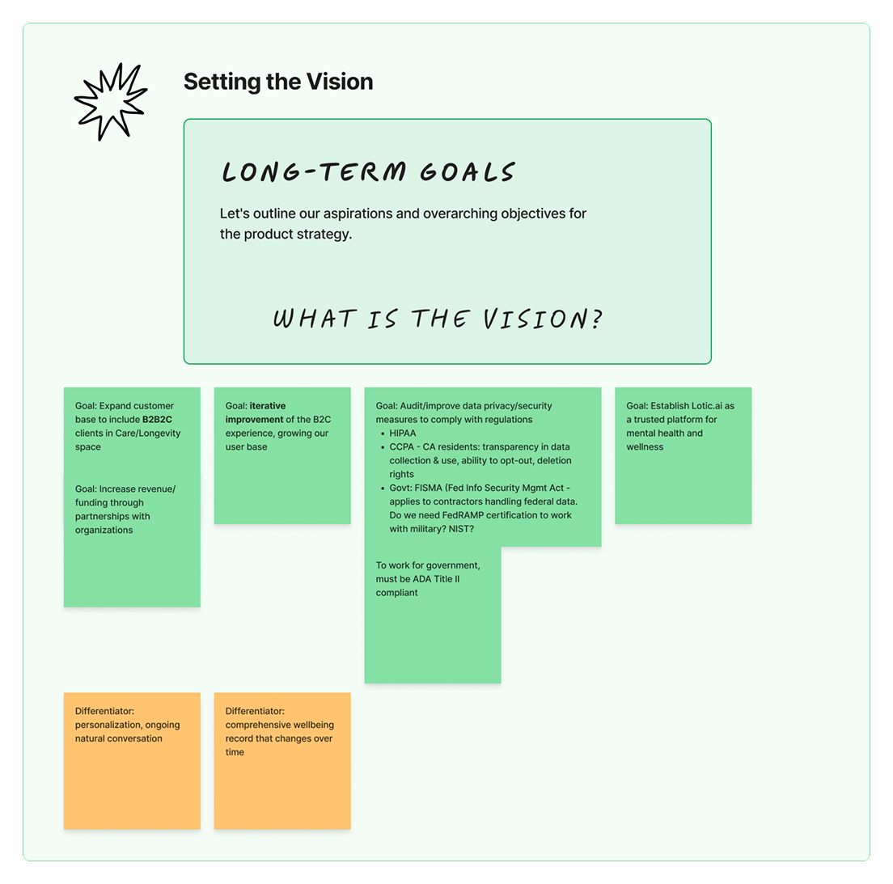

## The challenge

### Product-market fit against the clock

Lotic was searching for product-market fit. We had three months to launch an AI insights app, limited user research, and no market validation. No roadmap, and no agreed definition of what the product needed to be.

> How do you align a cross-functional team around something you can put in front of users fast enough to learn from — without committing to a direction you haven't validated?
>
> That was the real problem: the sequencing of decisions under a deadline that left no room to guess wrong twice.

## Approach

### Outcomes first, then the smallest test

I set customer outcomes first, then worked backward to the smallest thing that could test them. The release ran in two phases.

**Phase one · Alpha · 30 days** — Three of the eight wellbeing dimensions, delivered as a linear sequence of prompts with basic insight generation. Educational onboarding gave people a sample of the experience before account creation. The goal was to validate the core concept quickly, not to build the whole thing.

**Phase two · MVP** — All eight dimensions, a dynamic conversational UI that let people move organically between topics, and richer insights. This is where the product found its shape. I organized the work around two small squad teams and continuous research, defining learning objectives for each phase and feeding findings into the next iteration without slowing the build.

## From sequence to conversation

The Alpha ran on a linear prompt sequence. It worked, but it felt like a form. For the MVP I shifted to a conversational UI so people could move between wellbeing dimensions the way they actually talk about their lives. Someone stressed about work isn't only talking about work — it touches money, relationships, health.

The experience relied on the model recognizing these connections and guiding the conversation across dimensions on its own. That wasn't feasible in the timeframe, so I designed the bridge: context-aware prompt sequencing driven by keyword topic mapping, moving people across dimensions where it made sense and letting the system gather richer insights without the model steering.

The conversational UI drove a **27% increase in prompt completion** over the Alpha, and became the core interaction model for the platform's long-term engagement strategy.

## Research

### Designing for trust

Lotic asked people to speak out loud about the most personal parts of their lives, and an AI listened and reflected patterns back. It's a tall order to ask for.

> "It's kind of scary how quickly the AI was able to pinpoint things I'm scared about, and things I wish I got from the relationships in my life."

Research made the stakes concrete. The insights landed sometimes harder than people expected — powerful and unsettling in equal measure. Others were self-conscious speaking aloud, or unsure what to say. We added a text input option so no one was forced into a modality that made them uncomfortable, and kept people oriented in what the system was doing with what they shared.

Transparency and clear boundaries are critical in AI that engages people directly. Working with our clinical behaviorist, we designed safety guardrails into the experience: the system watched for signals of acute distress and, rather than continuing to probe, stepped back and pointed people toward mental health resources.

## Outcomes

### A validated core loop and a clear next horizon

Alpha research validated the core loop — most users found the insights relevant and the self-reflection valuable. It also surfaced what wasn't working: about a third hesitated because they didn't know what to say. That directly shaped the MVP with prompt options and text input alongside voice.

- **64%** of users made it past account creation in the Alpha
- **91%** of those completed the full prompt sequence
- **27%** lift in prompt completion, MVP over Alpha

<video controls playsinline preload="metadata" width="720" height="1560" aria-label="Screen recording of the Lotic app">
  <source src="/videos/lotic-app.mp4" type="video/mp4" />
  <source src="/videos/lotic-app.webm" type="video/webm" />
</video>

## Future vision

The MVP was built to become a platform for 30+ day engagement. The next horizon: modular frameworks for insights that adapt as a person's needs change, deeper pattern recognition over time, and a B2B2C clinical partner experience.

