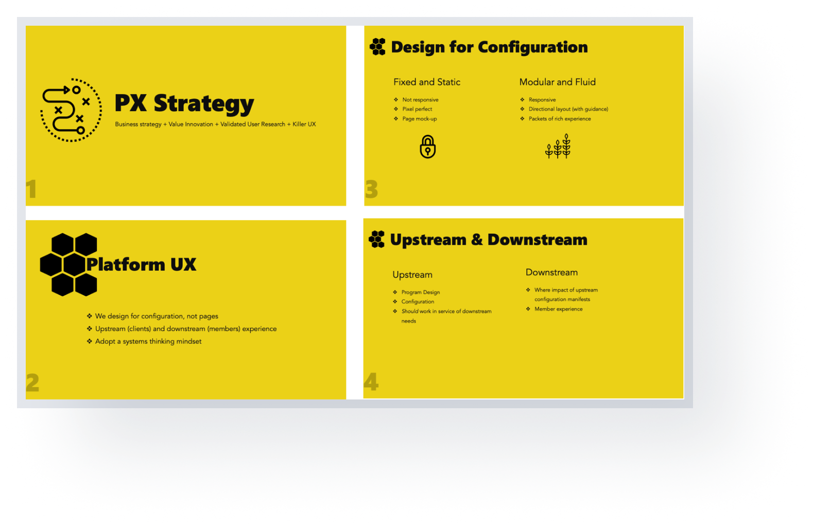
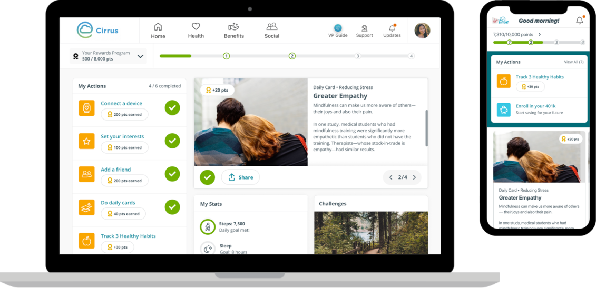
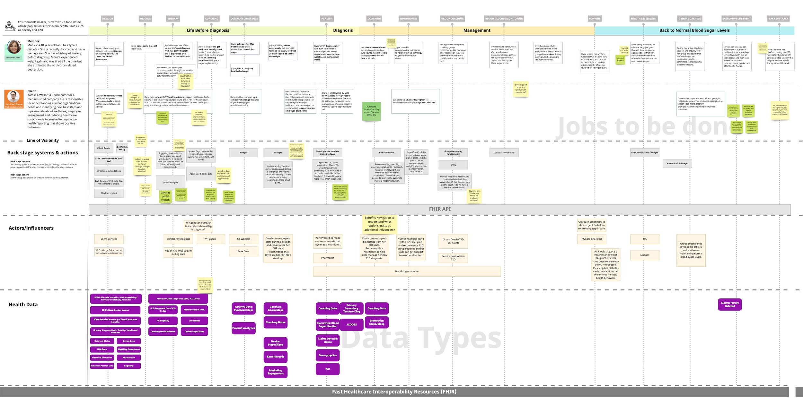

## The challenge

### One platform, many offerings

Virgin Pulse's Homebase for Health (HB4H) initiative aimed to transform its B2B2C wellness platform into a comprehensive health management solution. The expanded offering included Wellness, Condition Management, Benefits Navigation, and Health Analytics.

Two challenges emerged: how to create a seamless and flexible user experience for diverse offerings while retaining user engagement and usability, and how to allow clients (employers) to configure their instance of the platform to their needs while maintaining design cohesion.

## Approach

### Design for configuration, not pages

**Research-driven insights** — Conducted surveys with over 200 members and performed stack ranking exercises to identify priority features for both clients and end users. This was complemented by usability testing, card sorting, and preference testing to ensure designs met diverse user needs.

**Modular design strategy** — Developed a flexible, modular design strategy that allowed the platform to adapt to custom configurations while maintaining visual and functional coherence. This strategy ensured scalability and reduced the risk of design inconsistencies.

**Concept validation** — Created and tested multiple design concepts, focusing on features like rewards, daily tasks, and company announcements. Findings showed that integrating rewardable actions with company announcements resonated with both employees and clients.

**Iterative prototyping** — Led the team in prototyping, testing, and refining the core features, ensuring they addressed user needs and aligned with client goals.

## Outcomes

### A configurable platform that holds together

**A highly configurable platform** — Launched with support for Virgin Pulse's expanded offerings while maintaining a consistent and engaging user experience.

**A scalable modular system** — The modular design strategy streamlined client onboarding and allowed for rapid customization without breaking the design.

**A cohesive front door** — Connected users to the full range of HB4H services, and kept them on track with rewardable tasks available to complete.

## Service design blueprint

### Health Continuum: a patient-centered data model

To ground the platform in real member journeys, I created a service design blueprint following a member from life before diagnosis through management and back to normal blood sugar levels — mapping member and client actions, backstage systems, actors, and the FHIR-based health data flowing underneath each stage.

